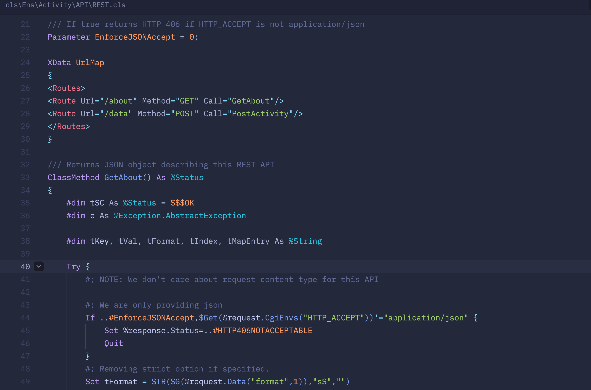
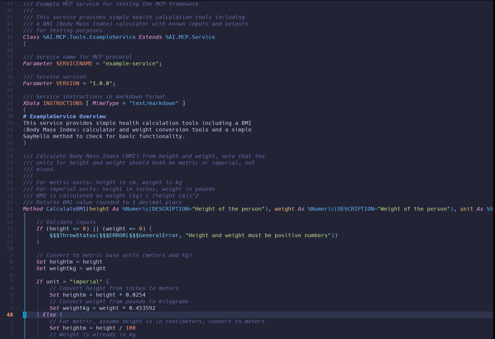

# tree-sitter-objectscript

A tree-sitter parser for InterSystems ObjectScript.

[](https://conventionalcommits.org)

## Introduction

This project provides a [Tree-sitter](https://tree-sitter.github.io/tree-sitter/) grammar for [InterSystems ObjectScript](https://docs.intersystems.com/latest/csp/docbook/DocBook.UI.Page.cls?KEY=GCOS_intro), enabling fast and precise syntax parsing for use in code editors, linters, and developer tooling.

**Tree-sitter** is a powerful parser generator and incremental parsing library widely used in modern development environments to deliver real-time syntax highlighting, structural editing, and code analysis. It constructs concrete syntax trees quickly and efficiently, even as code changes.

**InterSystems ObjectScript** is a dynamic, multi-paradigm programming language that combines procedural and object-oriented approaches with novel multi-model data access features for key-value, SQL, Object and Document stores. It is the core language for the InterSystems IRIS Data Platform, particularly well-known in mission-critical applications in healthcare, financial services, and other data-intensive domains.

This repository now publishes four related grammars:
- `objectscript`: playground/sandbox grammar for partial snippets (top-level statements and class members allowed).
- `objectscript_udl`: class-file grammar for `.cls` content.
- `objectscript_core`: routine/statement grammar.
- `objectscript_expr`: expression grammar.

The grammar currently integrates with these editors:
- [zed.dev](#zeddev)
- [neovim](#neovim-nvim-treesitter)
- [emacs](#emacs)

Given the polyglot nature of ObjectScript `.cls` files, it's recommended to ensure the following tree-sitter grammars are installed and available for injection:

- SQL 
- HTML 
- Python 
- JavaScript 
- CSS
- XML
- Markdown

All of these grammars are all available as Rust crates (and in other languages as well). 
For example, if I want to include these grammars in my rust project, 
I would simply add these under dependencies in my Cargo.Toml file: 
```Cargo
tree-sitter-html = "0.23.2"
tree-sitter-javascript = "0.25.0"
tree-sitter-python = "0.25.0"
tree-sitter-css = "0.25.0"
tree-sitter-sql = "0.0.2"
tree-sitter-xml = "0.7.0"
tree-sitter-md = "0.5.1"
```


## Screenshots

### Zed


### Neovim



## Editor Integrations

### zed.dev

Integration with the Zed editor is done as a [Zed Extension for ObjectScript](https://zed.dev/extensions/objectscript).  You can install from that page, or alternately use `zed: extensions` in the command panel to access the Extensions tab, from there just search for ObjectScript and click install.

### Neovim (nvim-treesitter)

#### Pre-requisites

Before use, you will need to have [nvim-treesitter:main](https://github.com/nvim-treesitter/nvim-treesitter/tree/main) plugin installed with your favorite package manager such as LazyVim.

#### Configuration

Associate the `.cls` extension with the objectscript parser by adding the following to `init.lua`, or, in the case you are using LazyVim, to your `config/autocmds.lua` file.

```lua
vim.filetype.add({
  extension = {
    cls = 'objectscript_udl',
  },
})
```

#### Installation
Open a new instance of neovim and type `:TSInstall objectscript_udl` to install the class-file parser.
For playground/snippet parsing (for example terminal-like input), also install `:TSInstall objectscript`.
After this completes and you've added the filetype mapping for `.cls` then you should be able to open `*.cls` files with ObjectScript syntax coloring (or use `set filetype=objectscript_udl` if you didn't add the mapping).

**NOTE**: On Windows, if the parser is currently in-use, nvim-treesitter will fail to update it; simply exit any nvim sessions and start a new one to redo the `:TSInstall objectscript` command.

#### Testing

Open up a .cls file in NeoVim:
```bash
~ $ nvim foo.cls
```
Highlighting should be automatic. If not, use `:TSBufEnable highlight`.

### Emacs

For Emacs 29.1 or later, we've implemented a [major mode for ObjectScript](https://github.com/intersystems/emacs-objectscript-ts-mode) using Emacs' built in tree-sitter support.  Follow the installation & setup instructions there.

## Reporting Issues

Please report issues via [GitHub Issues](https://github.com/intersystems/tree-sitter-objectscript/issues).

## Contributing

Contributions are welcome. Please submit changes via Pull Requests. Our preference is to use [Conventional Commits](https://www.conventionalcommits.org/en/v1.0.0/) for commit messages in order to keep the summaries terse, but allowing for more detail on the subsequent lines of the commit message.

### Project Overview

There are four main grammars in this repository:

- **objectscript**: Playground grammar that extends `udl` and allows mixed top-level ObjectScript snippets.
- **udl**: Grammar for `.cls` files (`objectscript_udl`) used for class definitions.
- **core**: Core ObjectScript routine syntax (lines/statements).
- **expr**: ObjectScript expressions.

Extension chain:
`objectscript` -> `udl` -> `core` -> `expr`

Detailed notes for the playground introduction commit are available in [docs/objectscript-playground-commit-notes.md](docs/objectscript-playground-commit-notes.md).

The reason behind the multiple grammar architecture is that there are cases where we need to inject ObjectScript
expressions as well as lines of ObjectScript into other grammars (see future work below).  Although it adds a little bit of complexity, it does promote reuse, for example a IRIS specific dialect of SQL could extend the stock SQL grammar and use tree-sitter injections to handle the ObjectScript extensions.

### Getting Started

You'll need to install the [tree-sitter-cli](https://github.com/tree-sitter/tree-sitter/blob/master/crates/cli/README.md) tooling (best done via your local package manager, e.g. homebrew on macOS, scoop on Windows).

Since there are four parsers, you'll need to cd into the directory containing the one you want to work on.

#### Build the Parser(s)

From the grammar directory, generate the state machines from the grammar and compile the native parser:
```bash
tree-sitter generate
tree-sitter build
```

**NOTE**: Use `tree-sitter build --wasm` when using the playground to test the grammar.

#### Running Tests

Tree-sitter has a built-in test runner:
```bash
tree-sitter test
```
Test cases live under `test/corpus`, where each file contains sample ObjectScript code and the expected parse tree.

#### Playground

Tree-sitter comes with a "playground" that allows you to test your grammar changes, visualize the AST as well as try out queries.

```bash
tree-sitter playground
```

This will start up a web browser running the playground with the .wasm built from the grammar using `tree-sitter build --wasm`.

#### Iterating on Changes

1. Edit grammar definitions (e.g., `grammar.js` and related files).
2. Rebuild and test:
   ```bash
   tree-sitter generate
   tree-sitter build
   tree-sitter test
   ```
3. Update or add cases in `test/corpus` as needed.
4. Repeat until all tests pass.

**NOTE**: Since `objectscript` extends `udl` which extends `core` which extends `expr`, if you make changes to an upstream grammar, regenerate/rebuild the downstream one(s).

## License

This project provided as-is and is licensed under the MIT License.

## Future Work

Future plans include creating a grammar for CSP by extending HTML and injecting `expr` and `core` grammar elements
to support `#(<expr>)#` and `<script language="cache" runat=server>...</script>` blocks of ObjectScript.

## Testing Bindings 
The binding tests verify that you can create a parser with your grammar.
### Rust 
From the root directory, run `cargo build` and then `cargo test`.

### Python 
From the root directory, run `python -m pip install -e .` and then `python -m pytest -q bindings/python/tests/test_binding.py`

### Swift
From the root directory, run `swift test`. Make sure you have `Xcode` downloaded from the App Store, and before running swift test, run `sudo xcode-select --switch /Applications/Xcode.app/Contents/Developer`

### Node 
I had to run this command for my changes to show up: 
`rm -rf node_modules build`

Additionally, for this one, make sure you have a compatible npm version. I had to lower my version to 20: `nvm install 20` and then `nvm use 20`

Once you have those prereqs complete, run `npm install` and then `npm test`
### Go
From the root directory run `go get github.com/tree-sitter/go-tree-sitter@v0.24.0` and then run `go test ./bindings/go/...`

### C
Run `make test`
