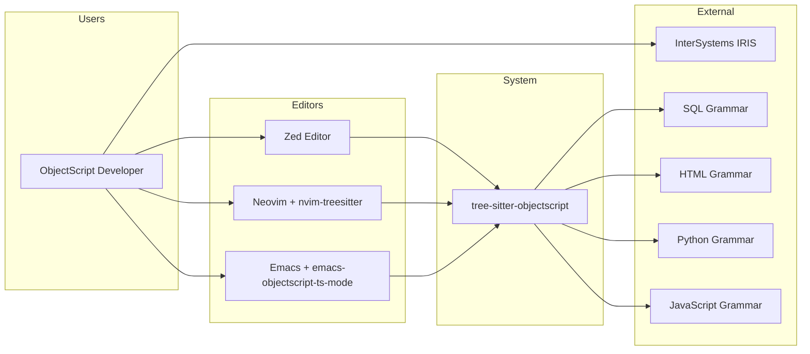
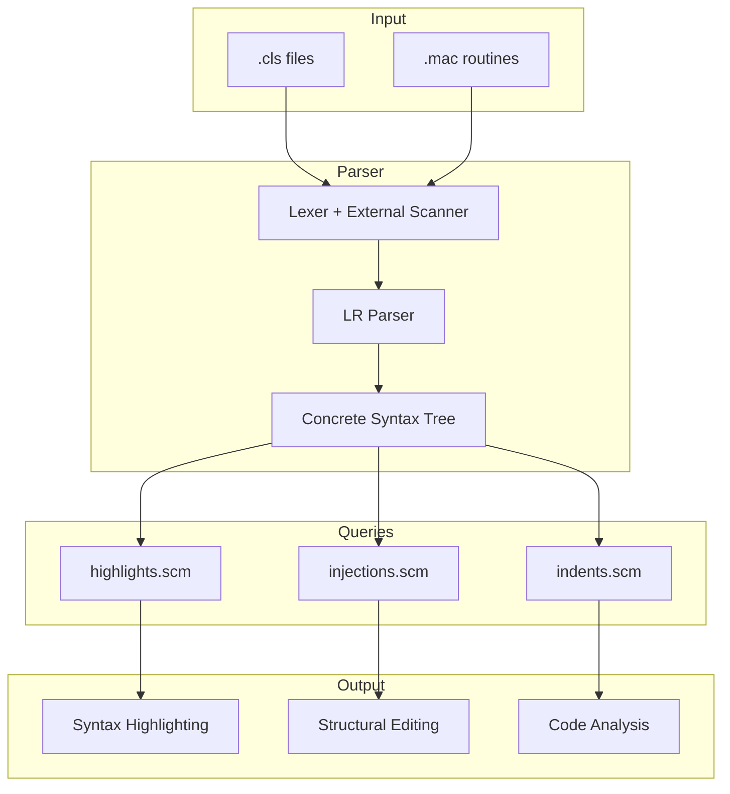
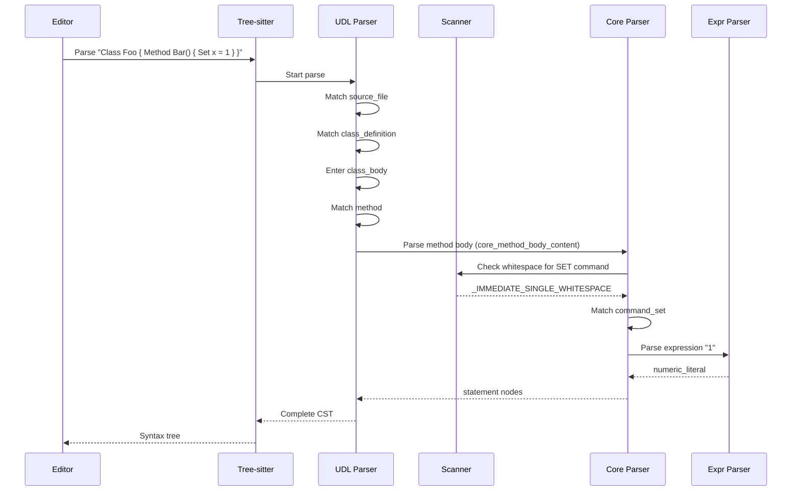
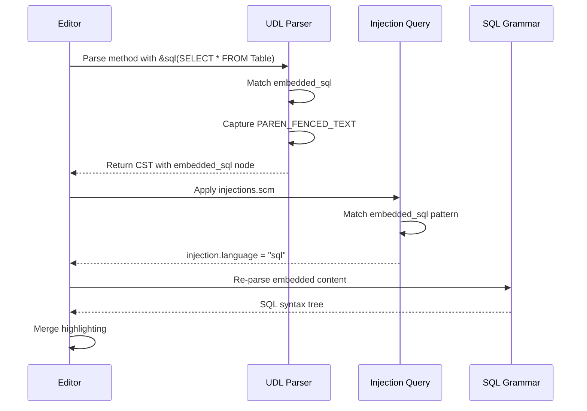

# arc42 Architecture Documentation: tree-sitter-objectscript

## 1. Introduction and Goals

### 1.1 Requirements Overview

**tree-sitter-objectscript** is a tree-sitter grammar for parsing InterSystems ObjectScript, a multi-paradigm programming language used in healthcare, financial services, and data-intensive applications.

| Requirement | Description |
|-------------|-------------|
| **R1** | Parse ObjectScript `.cls` files into concrete syntax trees |
| **R2** | Provide syntax highlighting for modern code editors (Zed, Neovim, Emacs) |
| **R3** | Support language injection for embedded SQL, HTML, Python, JavaScript, CSS, XML, Markdown |
| **R4** | Enable incremental parsing for real-time editor responsiveness |
| **R5** | Provide bindings for multiple languages (Rust, Node.js, Python, Go, Swift, C) |

**Evidence:**
- `README.md:1-30` — Introduction and feature list
- `tree-sitter.json:50-60` — Binding configuration

### 1.2 Quality Goals

| Priority | Quality Goal | Description |
|----------|--------------|-------------|
| 1 | **Correctness** | Accurately parse ObjectScript syntax per InterSystems documentation |
| 2 | **Performance** | Enable real-time parsing during editing without perceivable lag |
| 3 | **Extensibility** | Allow grammar extension for specialized ObjectScript dialects |
| 4 | **Portability** | Work across platforms (macOS, Linux, Windows) and editors |

### 1.3 Stakeholders

| Role | Expectations |
|------|--------------|
| ObjectScript Developers | Accurate syntax highlighting and code analysis in preferred editors |
| Editor Plugin Authors | Stable grammar API and query files for building extensions |
| InterSystems | Community-supported tooling for the ObjectScript ecosystem |
| Grammar Maintainers | Clean architecture enabling feature additions and bug fixes |

---

## 2. Architecture Constraints

### 2.1 Technical Constraints

| Constraint | Rationale |
|------------|-----------|
| **Tree-sitter framework** | Grammar must use tree-sitter DSL and external scanner API |
| **Context-free grammar limitations** | Some context-sensitive constructs require external scanner workarounds |
| **Whitespace sensitivity** | ObjectScript's significant whitespace requires scanner handling |
| **Case insensitivity** | Keywords and identifiers are case-insensitive |

### 2.2 Organizational Constraints

| Constraint | Rationale |
|------------|-----------|
| **MIT License** | Open-source license compatible with editor ecosystems |
| **Conventional Commits** | Commit format standardization for changelog generation |
| **InterSystems sponsorship** | Project maintained with InterSystems support |

### 2.3 Conventions

| Convention | Description |
|------------|-------------|
| Grammar hierarchy | `expr` → `core` → `udl` extension chain |
| Query file naming | `highlights.scm`, `injections.scm`, `indents.scm` |
| Test file format | Tree-sitter corpus format in `test/corpus/*.txt` |

**Evidence:**
- `README.md:140-180` — Contributing guidelines and conventions
- `LICENSE` — MIT license file
- `.commitlintrc.js` — Conventional commit configuration

---

## 3. System Scope and Context

### 3.1 Business Context



| Actor | Description |
|-------|-------------|
| ObjectScript Developer | Writes and edits `.cls` files |
| Code Editors | Consume grammar for syntax highlighting and analysis |
| InterSystems IRIS | Production target for ObjectScript code |
| Injection Grammars | Parse embedded languages within ObjectScript |

### 3.2 Technical Context



**Evidence:**
- `tree-sitter.json:7-10` — File types and scope
- `README.md:30-50` — Editor integration documentation

---

## 4. Solution Strategy

### 4.1 Key Decisions

| Decision | Rationale |
|----------|-----------|
| **Three-grammar hierarchy** | Enables reuse and injection at different granularities (expr, statements, classes) |
| **External scanner in C** | Required for whitespace-sensitive disambiguation |
| **Query-based highlighting** | Declarative approach for editor flexibility |
| **Language injection** | Leverages existing grammars for embedded SQL, HTML, Python, etc. |

### 4.2 Architecture Approach

The grammar follows a **layered extension** pattern:

1. **expr** (base): Expression-level parsing
   - Literals, operators, function calls
   - Object references and method calls
   - Indirection (`@`)

2. **core** (extends expr): Statement-level parsing
   - Commands (SET, DO, IF, FOR, etc.)
   - Control flow and procedures
   - Embedded languages (&sql, &html, &js)
   - Preprocessor directives (#define, #if, etc.)

3. **udl** (extends core): Class definition parsing
   - Class structure and keywords
   - Methods, properties, parameters
   - XData, storage, queries, triggers

**Evidence:**
- `udl/grammar.js:15-18` — Module imports showing hierarchy
- `core/grammar.js:5-8` — Core extends expr
- `README.md:145-165` — Project overview explaining grammar structure

---

## 5. Building Block View

### 5.1 Level 1: Grammar Modules

```
tree-sitter-objectscript/
├── expr/                    # Expression grammar
│   ├── grammar.js          # Expression rules
│   ├── queries/            # Expression highlights
│   └── test/corpus/        # Expression tests
├── core/                    # Core statement grammar
│   ├── grammar.js          # Statement rules (extends expr)
│   ├── queries/            # Statement highlights + injections
│   └── test/corpus/        # Statement tests
├── udl/                     # UDL class grammar
│   ├── grammar.js          # Class rules (extends core)
│   ├── keywords.js         # Keyword definitions
│   ├── queries/            # Class highlights + injections
│   └── test/corpus/        # Class tests
├── common/                  # Shared components
│   ├── grammar.js          # Grammar extension helper
│   ├── scanner.h           # External scanner
│   └── identifiers.js      # Identifier utilities
└── bindings/               # Language bindings
    ├── rust/
    ├── node/
    ├── python/
    ├── go/
    ├── swift/
    └── c/
```

### 5.2 Level 2: UDL Grammar Components

| Component | Responsibility | Key Rules |
|-----------|---------------|-----------|
| `source_file` | Top-level entry | Include/import + class_definition |
| `class_definition` | Class structure | name, extends, keywords, body |
| `method_definition` | Method parsing | Arguments, return type, body variants |
| `property` | Property declarations | Type, keywords |
| `xdata` | XData blocks | MimeType-based injection |
| `storage` | Storage XML | XML injection |

### 5.3 Level 2: Core Grammar Components

| Component | Responsibility | Key Rules |
|-----------|---------------|-----------|
| `statement` | Statement dispatch | All command types |
| `command_*` | Individual commands | SET, DO, IF, FOR, KILL, etc. |
| `embedded_*` | Embedded languages | SQL, HTML, XML, JavaScript |
| `pound_*` | Preprocessor | #define, #if, #include, etc. |
| `procedure` | Routine procedures | Tags, parameters, body |

### 5.4 Level 2: Expr Grammar Components

| Component | Responsibility | Key Rules |
|-----------|---------------|-----------|
| `expression` | Expression root | Binary, unary, atoms |
| `system_defined_function` | $functions | $LENGTH, $PIECE, etc. |
| `system_defined_variable` | $variables | $HOROLOG, $JOB, etc. |
| `oref_*` | Object references | Property access, method calls |
| `glvn` | Global/local variables | ^global, local |

**Evidence:**
- `udl/grammar.js:47-165` — Source file and class structure
- `core/grammar.js:80-150` — Statement choices
- `expr/grammar.js` — Expression rules

---

## 6. Runtime View

### 6.1 Parsing Scenario



### 6.2 Injection Scenario



**Evidence:**
- `core/grammar.js:900-950` — embedded_sql rules
- `core/queries/injections.scm` — SQL injection queries
- `udl/queries/injections.scm:1-50` — External method injections

---

## 7. Deployment View

### 7.1 Distribution Channels

| Channel | Package | Target |
|---------|---------|--------|
| npm | tree-sitter-objectscript | Node.js projects |
| Cargo | tree-sitter-objectscript | Rust projects |
| PyPI | tree-sitter-objectscript | Python projects |
| Zed Extensions | objectscript | Zed editor |
| nvim-treesitter | objectscript | Neovim |
| MELPA | emacs-objectscript-ts-mode | Emacs |

### 7.2 Build Artifacts

```
udl/
├── src/
│   ├── parser.c           # Generated C parser
│   ├── scanner.c          # Scanner wrapper
│   └── tree_sitter/       # Tree-sitter headers
├── parser.dylib           # macOS shared library
└── tree-sitter-objectscript.wasm  # WebAssembly build
```

**Evidence:**
- `package.json` — npm package configuration
- `Cargo.toml` — Rust crate configuration
- `README.md:200-250` — Testing bindings instructions

---

## 8. Cross-cutting Concepts

### 8.1 Whitespace Handling

ObjectScript's whitespace sensitivity requires careful scanner coordination:

| Pattern | Interpretation |
|---------|---------------|
| `QUIT` (no space) | Error or argumentless (context-dependent) |
| `QUIT ` (1 space) | Argumentful command follows |
| `QUIT  ` (2 spaces) | Argumentless command |
| `IF cond { }` | Block-style if |
| `IF cond cmd` | Old-style if |

### 8.2 Case Insensitivity

Keywords are case-insensitive, handled via regex patterns:

```javascript
keyword_set: (_) => /[sS]([eE][tT])?/,
keyword_if: (_) => /I(f)?/i,
```

### 8.3 Error Recovery

Tree-sitter provides automatic error recovery. The grammar uses:

- `SENTINEL` token to detect error recovery mode
- Careful conflicts declaration for ambiguous constructs
- `prec()` and `prec.right()` for precedence disambiguation

### 8.4 Language Injection

Injection queries use capture groups and predicates:

```scheme
(method_definition
  keywords: (external_method_keywords
    (method_keyword_language (rhs) @lang))
  body: (external_method_body_content) @injection.content
  (#match? @lang "(?i)^python$")
  (#set! injection.language "python"))
```

**Evidence:**
- `common/scanner.h:200-300` — Whitespace handling logic
- `udl/grammar.js:580` — Case-insensitive keyword example
- `udl/queries/injections.scm:15-40` — Python injection pattern

---

## 9. Architecture Decisions

### ADR-1: Three-Grammar Hierarchy

**Context**: ObjectScript expressions, statements, and class definitions have different use cases.

**Decision**: Implement three separate grammars that extend each other.

**Consequences**:
- (+) Expressions can be injected separately (e.g., in SQL extensions)
- (+) Statements can be injected for routine files
- (+) Clear separation of concerns
- (-) Upstream changes require downstream regeneration

### ADR-2: External Scanner for Whitespace

**Context**: Tree-sitter's context-free grammar cannot handle ObjectScript's whitespace sensitivity.

**Decision**: Use external scanner to detect argumentless commands and statement boundaries.

**Consequences**:
- (+) Correct parsing of whitespace-sensitive constructs
- (-) Scanner adds complexity and potential bugs
- (-) Scanner state must be serialized for incremental parsing

### ADR-3: Query-Based Injection

**Context**: ObjectScript embeds SQL, HTML, Python, JavaScript in method bodies.

**Decision**: Use tree-sitter injection queries rather than inline grammar rules.

**Consequences**:
- (+) Leverages existing mature grammars
- (+) Editor-configurable behavior
- (-) Requires users to install injection grammars
- (-) Some editors may not support all query predicates

**Evidence:**
- `README.md:145-180` — Grammar architecture explanation
- `common/scanner.h:1-40` — Scanner token definitions

---

## 10. Quality Requirements

### 10.1 Quality Tree

```
Quality
├── Functional Correctness
│   ├── Syntax coverage
│   └── Edge case handling
├── Performance
│   ├── Parse speed
│   └── Incremental update speed
├── Maintainability
│   ├── Grammar readability
│   └── Test coverage
└── Portability
    ├── Platform support
    └── Editor compatibility
```

### 10.2 Quality Scenarios

| ID | Scenario | Metric |
|----|----------|--------|
| QS-1 | Parse 10,000-line file | < 100ms |
| QS-2 | Incremental update on keystroke | < 10ms |
| QS-3 | All corpus tests pass | 100% |
| QS-4 | Build on macOS, Linux, Windows | All pass |

---

## 11. Risks and Technical Debt

### 11.1 Risks

| Risk | Probability | Impact | Mitigation |
|------|-------------|--------|------------|
| ObjectScript syntax changes | Low | Medium | Track InterSystems documentation |
| Tree-sitter breaking changes | Medium | High | Pin tree-sitter-cli version |
| Scanner bugs | Medium | High | Extensive test coverage |
| Injection query compatibility | Medium | Medium | Test on all target editors |

### 11.2 Technical Debt

| Item | Description | Effort |
|------|-------------|--------|
| TD-1 | Unimplemented preprocessor directives (#noshow, #sqlcompile, etc.) | Medium |
| TD-2 | CSP file support (HTML + ObjectScript) | High |
| TD-3 | Scanner state serialization optimization | Medium |

**Evidence:**
- `core/grammar.js:260-270` — TODO comment listing unimplemented preprocessor directives

---

## 12. Glossary

| Term | Definition |
|------|------------|
| **CST** | Concrete Syntax Tree — full parse tree with all tokens |
| **UDL** | Universal Definition Language — format for ObjectScript class files |
| **External Scanner** | Custom C code for context-sensitive lexing |
| **Injection** | Re-parsing embedded code with a different grammar |
| **GLVN** | Global or Local Variable Name |
| **OREF** | Object Reference — handle to an object instance |
| **XData** | XML data block embedded in class definitions |
| **Post-conditional** | `:condition` suffix on ObjectScript commands |

---

### Critical Data Structures

The following data structures are central to the grammar:

1. **`ObjectScript_Core_Scanner`** (`common/scanner.h:38-47`) — Scanner state including marker buffers
2. **`method_definition`** (`udl/grammar.js:275-290`) — Method AST structure with body variants
3. **`expression`** (`expr/grammar.js`) — Expression tree with operators and atoms
4. **`glvn`** (`expr/grammar.js`) — Global/local variable reference structure

---

## Assumptions

1. Tree-sitter runtime is version 0.20+ with external scanner support
2. Injection grammars are available and compatible with target editors
3. ObjectScript syntax follows InterSystems IRIS 2023.1+ documentation
4. Editors implement tree-sitter query predicates (#match?, #set!, etc.)

## Open Questions

1. Should the grammar support legacy Caché-only syntax that differs from IRIS?
2. How should we handle `.csp` files that require HTML grammar as the base with ObjectScript injection?
3. What is the best strategy for testing injection queries across different editors?

## Evidence

- `README.md:1-50` — Project introduction and goals
- `tree-sitter.json:1-80` — Complete grammar configuration
- `udl/grammar.js:1-600` — UDL grammar implementation
- `core/grammar.js:1-1200` — Core grammar implementation
- `common/scanner.h:1-700` — External scanner implementation
- `udl/keywords.js` — UDL keyword definitions
- `udl/queries/injections.scm:1-150` — Injection query patterns
