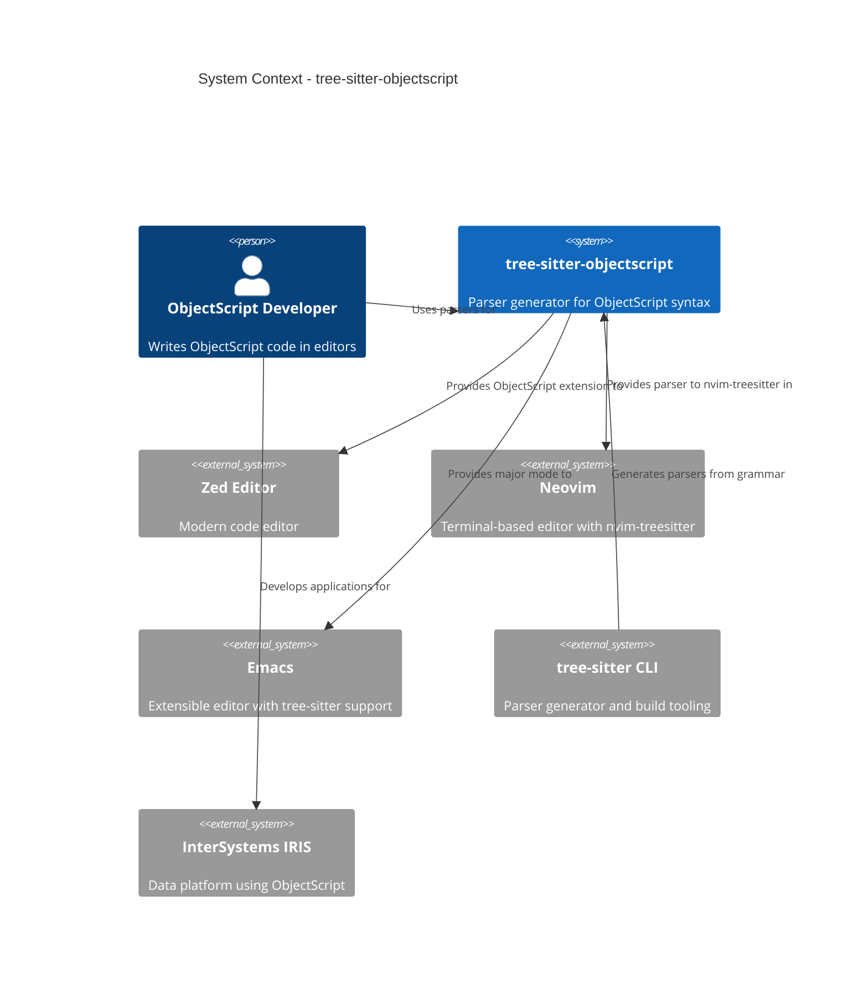
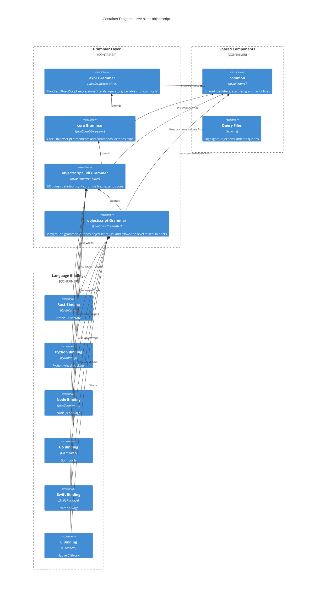
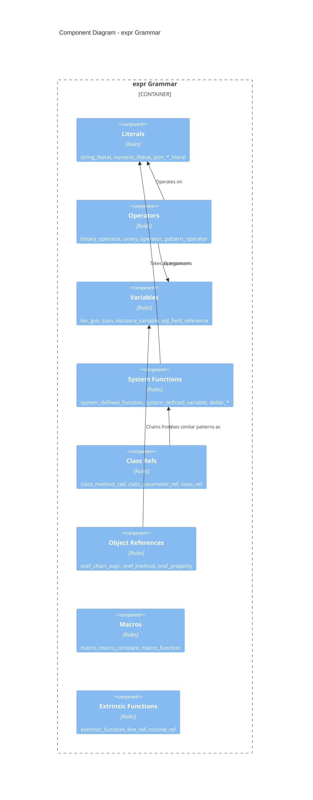
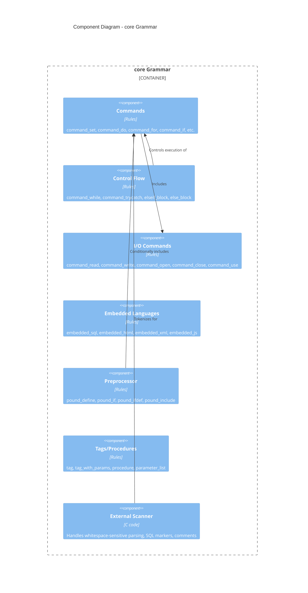
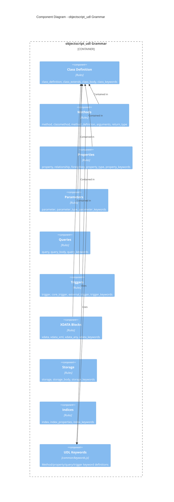
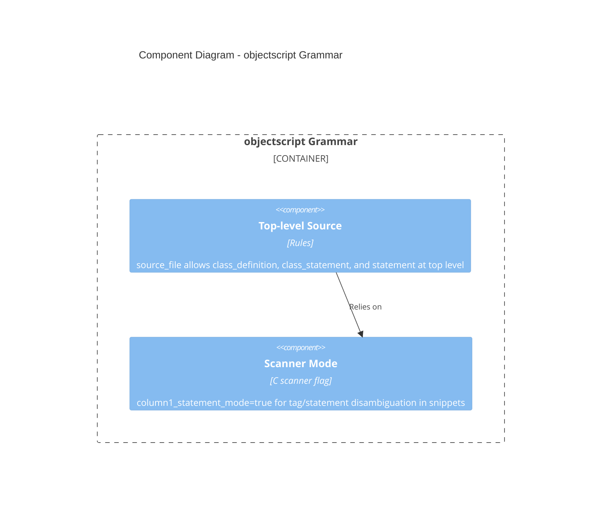
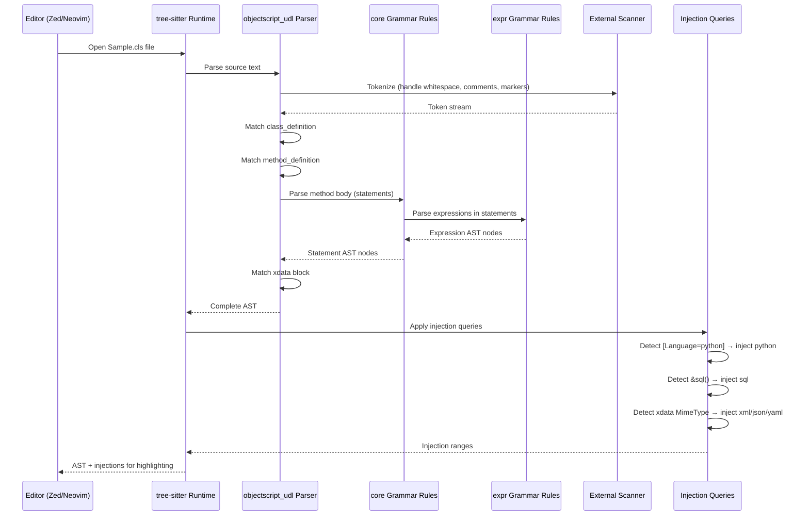

# C4 Model - tree-sitter-objectscript

> Update note (2026): `objectscript_routine` is now a first-class grammar path (`expr -> core -> objectscript_routine`) alongside the `expr -> core -> objectscript_udl -> objectscript` chain. See `README.md` and `CONTRIBUTING.md` for current workflows and commands.

## Overview

This document describes the architecture of tree-sitter-objectscript using the C4 model approach, covering system context, container, and component levels.

---

## Level 1: System Context

The tree-sitter-objectscript project provides parsing infrastructure for InterSystems ObjectScript, enabling syntax highlighting, code analysis, and structural editing in code editors.

### Narrative

Developers working with InterSystems IRIS use ObjectScript as their primary language. The tree-sitter-objectscript project generates parsers from grammar definitions that integrate with modern editors (Zed, Neovim, Emacs) to provide real-time syntax highlighting, structural editing, and code analysis. The tree-sitter CLI is used to generate and test parsers from the grammar specifications.

---

## Level 2: Container Diagram

The project contains four layered grammars and language bindings for multiple platforms.

### Narrative

The architecture uses a **layered grammar design**:

1. **expr** (base): Handles pure ObjectScript expressions—literals, operators, variable references (`lvn`, `gvn`, `ssvn`), system functions (`$PIECE`, `$LIST`, etc.), macros (`$$$`), and JSON literals.

2. **core** (extends expr): Adds statement-level constructs—commands (`SET`, `DO`, `FOR`, `IF`, etc.), control flow, embedded SQL/HTML/XML/JavaScript, preprocessor directives (`#define`, `#if`), and routine/tag definitions.

3. **objectscript_udl** (extends core): Adds class definition syntax for `.cls` files—class declarations, methods, properties, parameters, queries, triggers, XDATA blocks, indices, and storage definitions.

4. **objectscript** (extends objectscript_udl): Adds playground/sandbox top-level parsing so routine statements and class-member constructs can be parsed in mixed or partial snippets.

This layered approach enables reuse: the `expr` grammar can be injected into SQL dialects or CSP templates independently, `core` handles routine files, `objectscript_udl` handles class files, and `objectscript` handles playground/snippet input.

---

## Level 3: Component Diagram

### Grammar Components

### Narrative

The **expr grammar** decomposes ObjectScript expressions into:

- **Literals**: String (`"..."` with `""` escapes), numeric (integers, decimals, scientific), JSON (objects, arrays, booleans, null)
- **Operators**: Binary (`+`, `-`, `*`, `/`, `_`, `=`, `<`, `>`, `&`, `!`, `]`, `[`, etc.), unary (`+`, `-`, `'`), pattern (`?`, `'?`)
- **Variables**: Local (`lvn`), global (`^gvn`), structured system (`^$ssvn`), instance (`i%`, `r%`, `m%`)
- **System Functions**: Over 100 built-in functions (`$PIECE`, `$LIST`, `$GET`, `$ORDER`, `$ZDATE`, etc.) and special variables (`$HOROLOG`, `$JOB`, `$NAMESPACE`, etc.)
- **Class References**: `##class(pkg.Class).Method()` calls and parameter references
- **Object Chains**: `oref.prop.method().#Param` chains with method/property/parameter access
- **Macros**: `$$$MacroName` and `$$$MacroFunc(args)`
- **Extrinsic Functions**: `$$tag^routine(args)` and `$$@indirection`

---

### Core Grammar Components

### Narrative

The **core grammar** adds:

- **Commands**: 30+ ObjectScript commands including data manipulation (`SET`, `KILL`, `MERGE`), control flow (`IF`, `FOR`, `WHILE`, `DO`), I/O (`READ`, `WRITE`, `OPEN`, `CLOSE`, `USE`), transactions (`TSTART`, `TCOMMIT`, `TROLLBACK`), and debugging (`ZBREAK`, `ZWRITE`)
- **Control Flow**: Block-style (`IF {} ELSE {}`) and old-style (`IF condition commands...`) syntax
- **Embedded Languages**: `&sql()`, `&html<>`, `&xml<>`, `&js<>` blocks with language injection support
- **Preprocessor**: `#define`, `#if`/`#ifdef`/`#ifndef`/`#else`/`#endif`, `#include`, `#import`
- **Tags/Procedures**: Routine labels with optional parameters and procedure definitions with access modifiers
- **External Scanner**: C-based scanner (`common/scanner.h`) for whitespace-sensitive disambiguation, embedded language markers, and comment handling

---

### objectscript_udl Grammar Components

### Narrative

The **objectscript_udl grammar** models ObjectScript class definitions (`.cls` files):

- **Class Definition**: `Class pkg.ClassName Extends SuperClass [ Keywords ] { ... }`
- **Methods**: Instance and class methods with arguments, return types, and keyword modifiers (`[Language=python]`, `[CodeMode=expression]`, etc.)
- **Properties**: Instance properties with types, relationships, foreign keys
- **Parameters**: Class parameters with types and default values
- **Queries**: `%SQLQuery` definitions with SQL body injection
- **Triggers**: Database triggers with ObjectScript or external language bodies
- **XDATA**: Named XML/JSON/YAML/Markdown data blocks with MIME-type-based injection
- **Storage**: XML-based storage definitions
- **Indices**: Database indices on properties

---

### Playground Grammar Components

### Narrative

The **objectscript grammar** is the playground profile:

- Accepts top-level routine statements and class-member constructs
- Reuses UDL/core/expr rules via inheritance
- Uses scanner mode to disambiguate tags vs statements in column 1

---

## Dynamic Flow: Parsing a .cls File

### Narrative

1. Editor opens a `.cls` file and invokes tree-sitter
2. UDL parser delegates tokenization to the external scanner for whitespace/comment/marker handling
3. Class structure is parsed top-down: class definition → members (methods, properties, etc.)
4. Method bodies are parsed using core grammar rules, which delegate to expr for expressions
5. XDATA blocks and embedded languages are identified
6. Injection queries detect language markers and apply sub-parsers (Python, SQL, XML, etc.)
7. Final AST with injection ranges is returned for syntax highlighting

---

## Assumptions

- Grammars are designed for tree-sitter with external scanner support
- Binding surface varies by language:
  - Node/Python/Rust expose `objectscript` and `objectscript_udl`
  - Go/Swift/C also expose `objectscript_core` and `objectscript_expr`
- Injection queries require corresponding tree-sitter grammars to be installed (SQL, HTML, Python, etc.)

## Open Questions

- Will CSP template support (HTML + ObjectScript injection) be added as a fifth grammar?
- Should the `expr` grammar be published as a standalone crate for SQL dialect extension?

## Evidence

- `tree-sitter.json:1-80` — Grammar configuration and binding definitions
- `expr/grammar.js:1-50` — Expression grammar structure
- `core/grammar.js:1-100` — Core grammar extending expr
- `udl/grammar.js:1-100` — objectscript_udl grammar extending core
- `objectscript/grammar.js:1-80` — objectscript playground grammar extending objectscript_udl
- `common/scanner.h` — External scanner implementation
- `udl/queries/injections.scm:1-150` — Language injection queries
- `README.md:1-111` — Project overview and editor integrations
