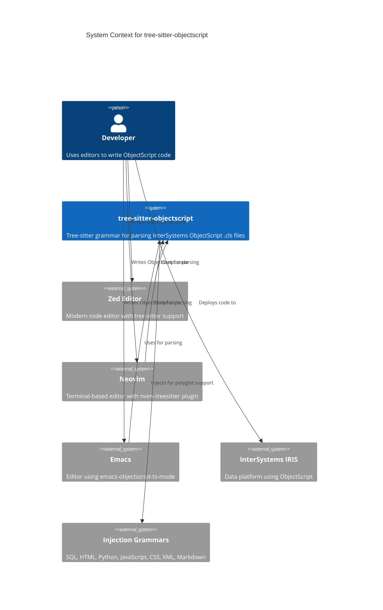
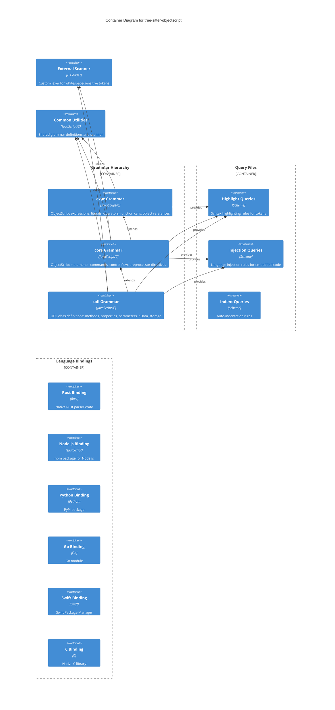
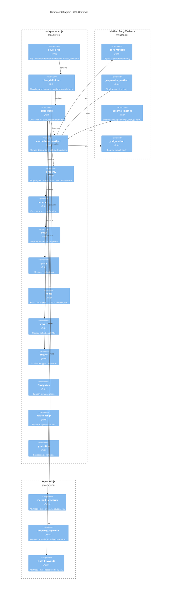
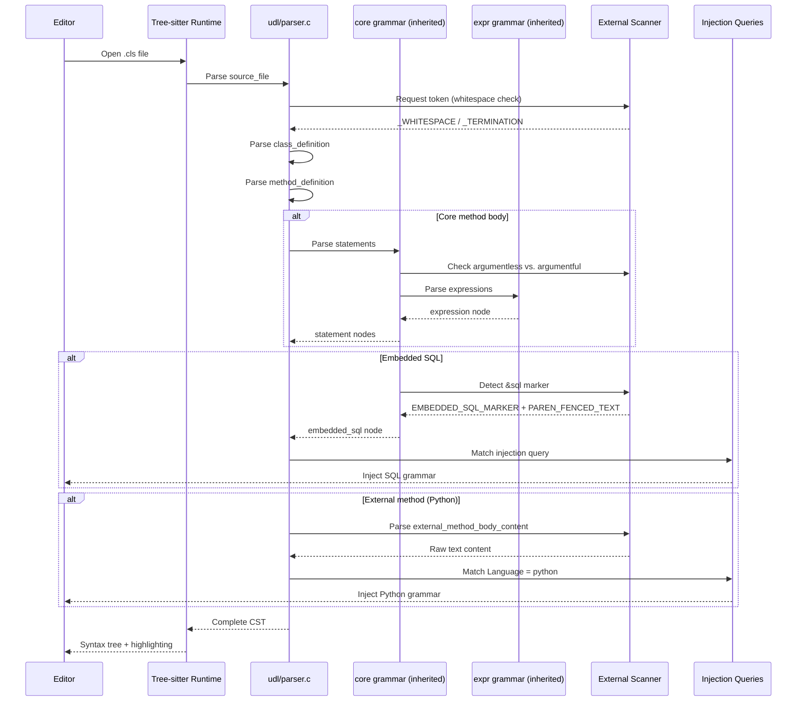

# C4 Model: tree-sitter-objectscript

## Overview

This document describes the architecture of tree-sitter-objectscript using the C4 model. The project provides a tree-sitter grammar for parsing InterSystems ObjectScript, enabling syntax highlighting, code analysis, and developer tooling integration.

---

## Level 1: System Context



### Narrative

**tree-sitter-objectscript** serves as a parsing layer between developers and their editors. When a developer opens an ObjectScript `.cls` file, the editor uses this grammar to:

1. Parse the code into a concrete syntax tree (CST)
2. Apply syntax highlighting via highlight queries
3. Inject other language grammars for embedded SQL, Python, HTML, JavaScript, etc.
4. Enable structural editing and code analysis features

**Evidence:**
- `README.md:1-45` — Project introduction and editor integrations
- `tree-sitter.json:1-60` — Grammar configuration including injections

---

## Level 2: Container Diagram



### Narrative

The project uses a **layered grammar architecture** to enable reuse and injection:

| Grammar | Scope | Key Constructs |
|---------|-------|----------------|
| `expr` | Expressions | Literals, operators, `$functions`, object references, `@indirection` |
| `core` | Statements | Commands (`SET`, `DO`, `IF`, etc.), control flow, embedded SQL/HTML/JS, macros |
| `udl` | Class files | Class definitions, methods, properties, parameters, queries, XData, storage |

The **external scanner** (`common/scanner.h`) handles ObjectScript's whitespace-sensitive syntax, including:
- Argumentless vs. argumentful command detection
- Tag/label parsing at column 0
- Embedded language fencing (`&sql()`, `&html<>`, `&js<>`)
- Macro continuation lines

**Evidence:**
- `udl/grammar.js:15-18` — Grammar extension chain
- `core/grammar.js:5-8` — Core extends expr
- `common/scanner.h:1-50` — External scanner token types
- `tree-sitter.json:5-40` — Grammar paths and highlight/injection file lists

---

## Level 3: Component Diagram (UDL Grammar)



### Narrative

The UDL grammar parses ObjectScript `.cls` files with the following structure:

```
source_file
├── include_code / include_generator / import_code (optional)
└── class_definition
    ├── keyword_class
    ├── identifier (class name)
    ├── class_extends (optional)
    ├── class_keywords (optional)
    └── class_body { ... }
        ├── method / classmethod
        ├── property
        ├── parameter
        ├── index
        ├── query
        ├── xdata
        ├── storage
        ├── trigger
        ├── foreignkey
        ├── relationship
        └── projection
```

**Method body variants** determine how the body is parsed:
- `_core_method`: Standard ObjectScript (parsed by `core` grammar)
- `_expression_method`: Single expression with `[ CodeMode = expression ]`
- `_external_method`: External language body (`[ Language = python ]`)
- `_call_method`: Routine call with `[ CodeMode = call ]`

**Evidence:**
- `udl/grammar.js:69-95` — source_file and class_definition rules
- `udl/grammar.js:115-165` — class_statement choices
- `udl/grammar.js:275-340` — method_definition and body variants
- `udl/keywords.js` — Keyword rule definitions

---

## Level 4: Code Diagram (External Scanner)

```mermaid
flowchart TD
    subgraph Scanner["External Scanner (scanner.h)"]
        scan[ObjectScript_Core_Scanner_scan]
        
        scan --> sentinel{SENTINEL valid?}
        sentinel -->|Yes| error[Return false - error recovery]
        sentinel -->|No| token_check
        
        token_check --> ws_check{Whitespace handling?}
        ws_check -->|Yes| argumentless[Detect argumentless commands]
        ws_check -->|Yes| termination[Detect statement termination]
        ws_check -->|Yes| bol[Detect beginning of line]
        
        token_check --> tag_check{TAG at column 0?}
        tag_check -->|Yes| tag[Parse tag/label]
        
        token_check --> fenced{Fenced text?}
        fenced -->|ANGLED| angle_fence[Parse < ... > content]
        fenced -->|PAREN| paren_fence[Parse ( ... ) content]
        
        token_check --> comment{Comment?}
        comment -->|Line| line_comment[Parse to newline]
        comment -->|Block| block_comment[Parse to */]
        
        token_check --> marker{SQL/HTML marker?}
        marker -->|Yes| marker_parse[Parse marker for injection]
        
        token_check --> macro{Macro continue?}
        macro -->|Yes| macro_continue[Parse ##continue]
    end
    
    subgraph Tokens["Key External Tokens"]
        t1[_IMMEDIATE_SINGLE_WHITESPACE_FOLLOWED_BY_NON_WHITESPACE]
        t2[_ARGUMENTLESS_COMMAND_END]
        t3[_ARGUMENTLESS_LOOP]
        t4[_TERMINATION]
        t5[_BOL]
        t6[TAG]
        t7[ANGLED_BRACKET_FENCED_TEXT]
        t8[PAREN_FENCED_TEXT]
        t9[EMBEDDED_SQL_MARKER]
        t10[HTML_MARKER]
    end
    
    argumentless --> t1
    argumentless --> t2
    argumentless --> t3
    termination --> t4
    bol --> t5
    tag --> t6
    angle_fence --> t7
    paren_fence --> t8
    marker_parse --> t9
    marker_parse --> t10
```

### Narrative

The **external scanner** is critical for handling ObjectScript's context-sensitive syntax:

1. **Whitespace sensitivity**: ObjectScript uses whitespace to distinguish:
   - Argumentless commands (`QUIT` alone vs. `QUIT expr`)
   - Block vs. old-style control flow (`IF { }` vs. `IF cond commands`)

2. **Tag detection**: Labels must start at column 0 with an alphanumeric or `%`

3. **Fenced text**: Embedded languages use balanced delimiters:
   - `&sql(...)` — SQL within parentheses
   - `&html<...>` — HTML within angle brackets
   - Custom markers like `&sqlABC(...)ABC` for nested delimiters

4. **State management**: Scanner tracks `terminated_newline` to properly detect dotted statements (`.` scope indicators)

**Evidence:**
- `common/scanner.h:1-40` — Token type enum
- `common/scanner.h:100-200` — Main scan function logic
- `common/scanner.h:50-80` — Fenced text parsing functions

---

## Dynamic Diagram: Parsing Flow



### Narrative

The parsing flow demonstrates the grammar hierarchy in action:

1. **Initial parse**: Editor requests parse of `.cls` file
2. **Grammar delegation**: UDL grammar handles class structure, delegating to `core` for method bodies
3. **Scanner coordination**: External scanner resolves ambiguities around whitespace and command arguments
4. **Language injection**: Injection queries identify embedded code and invoke appropriate sub-grammars

**Evidence:**
- `udl/queries/injections.scm:1-100` — Injection query patterns
- `core/grammar.js:30-50` — External token declarations
- `udl/grammar.js:275-340` — Method body variant selection

---

## Assumptions

1. Editors using this grammar have tree-sitter runtime version compatible with external scanners
2. Injection grammars (SQL, HTML, Python, etc.) are installed separately by the user
3. The grammar targets InterSystems IRIS ObjectScript dialect (may not cover legacy Caché-only syntax)

## Open Questions

1. How should the grammar handle CSP (Caché Server Pages) files that mix HTML and ObjectScript?
2. Should there be a separate grammar variant for `.mac` routine files vs. `.cls` class files?
3. What is the performance impact of the three-grammar inheritance chain on large files?

## Evidence

- `README.md:1-45` — Project overview and purpose
- `tree-sitter.json:1-80` — Grammar configuration
- `udl/grammar.js:1-500` — UDL grammar implementation
- `core/grammar.js:1-1200` — Core grammar with commands
- `common/scanner.h:1-700` — External scanner implementation
- `udl/queries/injections.scm:1-150` — Language injection queries
