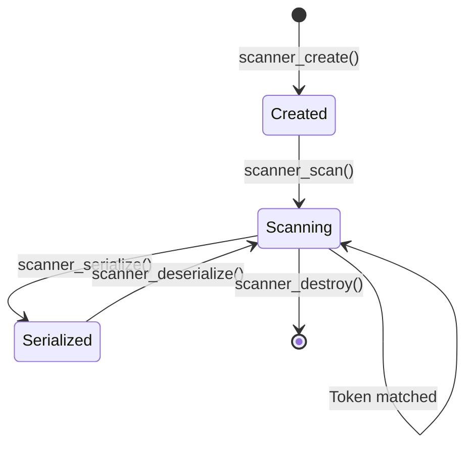

# Data Structure: ObjectScript_Core_Scanner

## Overview

The `ObjectScript_Core_Scanner` is the state structure for tree-sitter's external scanner, responsible for handling ObjectScript's whitespace-sensitive and context-dependent lexing requirements.

## Definition

**Location:** `common/scanner.h:38-47`

```c
#define MARKER_BUFFER_MAX_LEN 30
struct ObjectScript_Core_Scanner {
  int32_t marker_buffer[MARKER_BUFFER_MAX_LEN];
  int marker_buffer_len;
  bool terminated_newline;
  int32_t html_marker_buffer[MARKER_BUFFER_MAX_LEN];
  int html_marker_buffer_len;
  int32_t sql_marker_buffer[MARKER_BUFFER_MAX_LEN];
  int sql_marker_buffer_len;
  int32_t js_marker_buffer_reversed[MARKER_BUFFER_MAX_LEN];
  int js_marker_buffer_reversed_len;
};
```

## Fields

| Field | Type | Purpose |
|-------|------|---------|
| `marker_buffer` | `int32_t[30]` | General-purpose marker storage (legacy) |
| `marker_buffer_len` | `int` | Length of marker_buffer content |
| `terminated_newline` | `bool` | Tracks if last statement ended with newline |
| `html_marker_buffer` | `int32_t[30]` | Stores HTML/JS fence marker characters |
| `html_marker_buffer_len` | `int` | Length of HTML marker |
| `sql_marker_buffer` | `int32_t[30]` | Stores SQL fence marker characters |
| `sql_marker_buffer_len` | `int` | Length of SQL marker |
| `js_marker_buffer_reversed` | `int32_t[30]` | Reversed JS marker for closing match |
| `js_marker_buffer_reversed_len` | `int` | Length of reversed JS marker |

## Ownership

- **Created by:** Tree-sitter runtime via `tree_sitter_objectscript_core_external_scanner_create()`
- **Owned by:** Tree-sitter parser instance
- **Destroyed by:** Tree-sitter runtime via `tree_sitter_objectscript_core_external_scanner_destroy()`

## Lifecycle



### State Transitions

1. **Creation**: Scanner is allocated with zeroed state
2. **Scanning**: `scanner_scan()` is called repeatedly to match tokens
3. **Serialization**: State is saved for incremental parsing checkpoints
4. **Deserialization**: State is restored when re-parsing from checkpoint
5. **Destruction**: Scanner memory is freed

## Key Invariants

1. **`marker_buffer_len`** must be `<= MARKER_BUFFER_MAX_LEN` (30)
2. **`terminated_newline`** must be updated after every token that ends a statement
3. **Marker buffers** must be reset to 0 length after successful match or mismatch

## Update Paths

### `terminated_newline` Updates

| Location | Condition | New Value |
|----------|-----------|-----------|
| `scanner.h:155` | Token is `_TERMINATION` and char is `\n` | `true` |
| `scanner.h:160` | Token is `_TERMINATION` and char is not `\n` | `false` |
| `scanner.h:210` | Token is `_ARGUMENTLESS_LOOP` | `false` |
| `scanner.h:380` | Token is `_WHITESPACE` | `false` |
| `scanner.h:420` | Token is `_BOL` with dots | `false` |

### Marker Buffer Updates

| Buffer | Update Location | Trigger |
|--------|----------------|---------|
| `html_marker_buffer` | `scanner.h:95-115` | `HTML_MARKER` token valid |
| `sql_marker_buffer` | `scanner.h:130-150` | `EMBEDDED_SQL_MARKER` token valid |
| `js_marker_buffer_reversed` | `scanner.h:108-113` | Built from `html_marker_buffer` |

## Serialization Format

The scanner state is serialized for incremental parsing:

```c
// Pseudocode for serialization
void serialize(Scanner *s, char *buffer, unsigned *length) {
  memcpy(buffer, &s->terminated_newline, sizeof(bool));
  memcpy(buffer + offset, &s->html_marker_buffer_len, sizeof(int));
  memcpy(buffer + offset, s->html_marker_buffer, s->html_marker_buffer_len * sizeof(int32_t));
  // ... repeat for other buffers
}
```

## Usage Examples

### Detecting Argumentless Command

```c
// In scanner_scan():
if (valid_symbols[_ARGUMENTLESS_COMMAND_END] && count == 2 && !is_block) {
    lexer->result_symbol = _ARGUMENTLESS_COMMAND_END;
    scanner->terminated_newline = false;
    return true;
}
```

### Matching HTML Fence Marker

```c
// Capture forward marker
while (!lexer->eof(lexer) && is_validHTML_MARKER_char(lexer->lookahead)) {
    scanner->html_marker_buffer[scanner->html_marker_buffer_len++] = lexer->lookahead;
    advance(lexer);
}
// Build reversed marker for closing match
for (int i = 0; i < scanner->html_marker_buffer_len; i++) {
    scanner->js_marker_buffer_reversed[i] = 
        scanner->html_marker_buffer[scanner->html_marker_buffer_len - 1 - i];
}
```

## Related Structures

- **Token Types**: `enum ObjectScript_Core_Scanner_TokenType` (`scanner.h:1-35`)
- **Lexer Interface**: `TSLexer` (tree-sitter API)

## Assumptions

1. Scanner state size fits within tree-sitter's serialization buffer limit
2. Unicode characters in markers fit within `int32_t`
3. Markers are never longer than 30 characters

## Open Questions

1. Should marker buffer size be configurable or increased?
2. Is `marker_buffer` (general) still needed or can it be removed?

## Evidence

- `common/scanner.h:38-47` — Structure definition
- `common/scanner.h:50-120` — Marker handling functions
- `common/scanner.h:400-500` — Scan function with state updates
