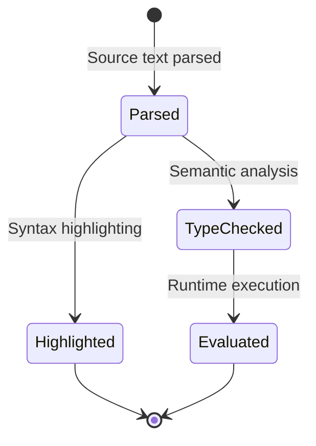

# Data Structure: expression

## Overview

The `expression` rule defines the AST structure for ObjectScript expressions—the fundamental building blocks for values, computations, and object interactions. It serves as the root of the `expr` grammar.

## Definition

**Location:** `expr/grammar.js:32-40`

```javascript
expression: ($) =>
  prec.left(
    seq(
      $.expr_atom,
      repeat($.expr_tail),
    ),
  ),
```

## AST Node Structure

```
expression
├── expr_atom (first operand)
│   └── (one of many atom types)
└── expr_tail* (operators and subsequent operands)
    ├── operator: binary_operator
    └── expression (right operand)
```

## Expression Atoms

The `expr_atom` rule defines all possible expression starting points:

**Location:** `expr/grammar.js:42-78`

```javascript
expr_atom: ($) =>
  choice(
    // Literals
    $.string_literal,
    $.numeric_literal,
    $.json_object_literal,
    $.json_array_literal,

    // Variables
    $.lvn,                    // Local variable
    $.gvn,                    // Global variable
    $.ssvn,                   // Structured system variable
    $.instance_variable,      // i%prop, r%prop, m%prop
    $.sql_field_reference,    // {fieldname}

    // Built-in functions
    $.system_defined_variable,  // $HOROLOG, $JOB, etc.
    $.system_defined_function,  // $LENGTH(), $PIECE(), etc.
    $.dollarsf,                 // $SYSTEM.class.method()

    // User-defined functions
    $.extrinsic_function,       // $$label^routine()

    // Object references
    $.relative_dot_property,    // ..PropertyName
    $.relative_dot_method,      // ..MethodName()
    $.relative_dot_parameter,   // ..#ParamName
    $.oref_chain_expr,          // oref.prop.method()

    // Class references
    $.class_method_call,        // ##class(Cls).Method()
    $.class_parameter_ref,      // ##class(Cls).#Param
    $.superclass_method_call,   // ##super()

    // Special
    $.unary_expression,         // +x, -x, 'x, @indirect
    $._parenthetical_expression, // (expr)
    $.macro,                    // $$$MacroName
  ),
```

## Binary Operators

**Location:** `expr/grammar.js:91-125`

| Category | Operators | Description |
|----------|-----------|-------------|
| Arithmetic | `**`, `*`, `/`, `\\`, `#`, `+`, `-` | Math operations |
| Comparison | `=`, `'=`, `<`, `<=`, `'>`, `>`, `>=`, `'<` | Value comparison |
| Logical | `!`, `\|\|`, `'!`, `&`, `&&`, `'&`, `'` | Boolean logic |
| String | `_`, `]`, `']`, `[`, `'[`, `]]`, `']]` | String operations |
| Pattern | `?`, `'?` | Pattern matching |

**Note:** All ObjectScript operators have the same precedence (left-associative).

## Unary Expressions

**Location:** `expr/grammar.js:82-98`

```javascript
unary_expression: ($) =>
  choice(
    seq(field('operator', $._unary_operator), $.expression),
    seq(field('operator', '@'), $.glvn, optional(
      seq(token.immediate('@'), $.subscripts)),
    ),
  ),
_unary_operator: (_) => choice('+', '-', "'"),
```

| Operator | Meaning |
|----------|---------|
| `+` | Numeric positive |
| `-` | Numeric negation |
| `'` | Logical NOT |
| `@` | Indirection |

## Key Sub-Structures

### Local Variable (`lvn`)

**Location:** `expr/grammar.js:260`

```javascript
lvn: ($) => prec.right(seq($.objectscript_identifier, optional($.subscripts))),
```

**Examples:** `x`, `arr(1)`, `data("key",2)`

### Global Variable (`gvn`)

**Location:** `expr/grammar.js:250-260`

```javascript
gvn: ($) => prec.right(seq(
  '^',
  optional(/* namespace */),
  optional(token.immediate(/* name */)),
  optional($.subscripts),
)),
```

**Examples:** `^Data`, `^|"NS"|Global(1)`, `^["%SYS"]Config`

### Object Reference Chain (`oref_chain_expr`)

**Location:** `expr/grammar.js:295-320`

```javascript
oref_chain_expr: ($) =>
  prec.right(2, seq(
    choice($.lvn, $.instance_variable, /* ... */),
    repeat1($._oref_chain_segment),
    optional(seq(token.immediate('.'), $.oref_parameter)),
  )),
```

**Examples:** `obj.Prop`, `obj.Method()`, `obj.A.B().C`

### System Functions (`system_defined_function`)

**Location:** `expr/grammar.js:410-550`

Includes specialized rules for:
- `dollar_piece` — `$PIECE(str,delim,from,to)`
- `dollar_extract` — `$EXTRACT(str,from,to)`
- `dollar_list` — `$LIST(list,pos)`
- `dollar_case` — `$CASE(val, match:result, ...)`
- `dollar_select` — `$SELECT(cond:val, ...)`
- `dollar_function` — Generic `$FUNC(args...)`

## Ownership

- **Parent:** Various statement rules in `core` grammar, method bodies in `udl`
- **Created by:** Parser during expression parsing
- **Consumed by:** Evaluators, type checkers, code generators

## Lifecycle



## Invariants

1. `expression` always has at least one `expr_atom`
2. Binary operators require both left and right operands
3. Subscripts require at least one expression
4. Method args may have empty positions (passed by reference detection)

## Precedence Rules

**Location:** `expr/grammar.js:22-28`

```javascript
precedences: ($) => [
  [$.oref_method, $.oref_property],
  [$.method_arg, $.subscripts],
  [$.oref_chain_expr, $.expr_atom],
  [$.label_ref, $.lvn],
  [$.class_method_call, $.oref_method],
],
```

These resolve ambiguities:
- `obj.name()` → method call, not property with subscripts
- `$$label^routine` → extrinsic function, not variable

## Query Patterns

### Highlight Literals
```scheme
(numeric_literal) @number
(string_literal) @string
```

### Highlight Functions
```scheme
(system_defined_function
  (dollar_piece) @function.builtin)
(system_defined_function
  (dollar_function
    builtin_function: _ @function.builtin))
```

### Highlight Variables
```scheme
(lvn (objectscript_identifier) @variable)
(gvn) @variable.global
```

**Location:** `expr/queries/highlights.scm`

## Related Structures

- `statement` — Contains expressions in commands
- `method_args` — Expression list for function calls
- `subscripts` — Expression list for array access
- `glvn` — Union of `gvn`, `lvn`, `ssvn`, `macro`

## Assumptions

1. All binary operators have equal precedence (per ObjectScript spec)
2. Indirection (`@`) can appear in most expression contexts
3. JSON literals are valid ObjectScript expressions

## Open Questions

1. Should pattern expressions (`?1N2A`) be first-class expression atoms?
2. How should expression type inference work for language servers?

## Evidence

- `expr/grammar.js:32-78` — Expression and atom definitions
- `expr/grammar.js:91-125` — Binary operator list
- `expr/grammar.js:250-320` — Variable and object reference rules
- `expr/queries/highlights.scm` — Highlight patterns
- `expr/test/corpus/` — Expression test cases
