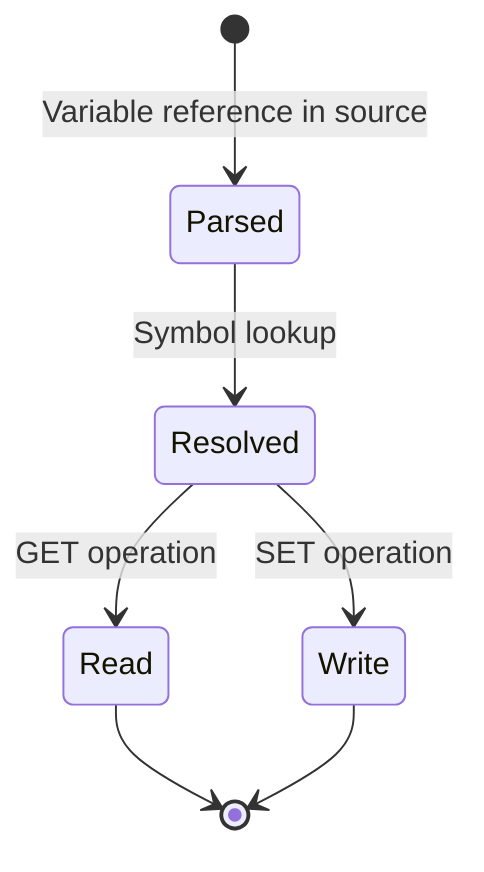

# Data Structure: glvn

## Overview

The `glvn` (Global or Local Variable Name) rule defines the AST structure for variable references in ObjectScript. It's a union type that encompasses global variables, local variables, structured system variables, macros, and indirected references.

## Definition

**Location:** `expr/grammar.js:247`

```javascript
glvn: ($) => choice($.gvn, $.lvn, prec(-1, $.ssvn), prec.right(1, $.macro), $.indirected_glvn),
```

## AST Node Structure

```
glvn
└── (one of)
    ├── gvn (global variable)
    │   ├── '^'
    │   ├── namespace? (|expr| or [expr] or ||)
    │   ├── name? (identifier)
    │   └── subscripts? (expr, expr, ...)
    ├── lvn (local variable)
    │   ├── objectscript_identifier
    │   └── subscripts?
    ├── ssvn (structured system variable)
    │   ├── '^$'
    │   ├── identifier_segment_immediate
    │   └── subscripts?
    ├── macro
    │   ├── '$$$'
    │   ├── macro_name
    │   └── method_args? (for macro functions)
    └── indirected_glvn
        ├── '@'
        ├── base (lvn | gvn | ssvn | parameter_ref)
        ├── '@'
        └── subscripts
```

## Variant Details

### 1. Global Variable (`gvn`)

**Location:** `expr/grammar.js:249-262`

```javascript
gvn: ($) =>
  prec.right(seq(
    '^',
    optional(choice(
      token.immediate('||'),                    // Implicit namespace
      seq(token.immediate('|'), $.expression, '|'),  // Extended reference
      seq(token.immediate('['), $.expression, ']'),  // Namespace bracket
    )),
    optional(token.immediate(/[%A-Za-z][A-Za-z0-9]*(\.[A-Za-z0-9]+)*/)),
    optional($.subscripts),
  )),
```

**Examples:**
| Syntax | Meaning |
|--------|---------|
| `^Data` | Global in current namespace |
| `^Data(1,"key")` | Subscripted global |
| `^\|"SAMPLES"\|Data` | Global in SAMPLES namespace |
| `^\|\|Data` | Global via implicit namespace |
| `^["SAMPLES"]Data` | Alternate namespace syntax |
| `^(1)` | Naked global reference |

### 2. Local Variable (`lvn`)

**Location:** `expr/grammar.js:263`

```javascript
lvn: ($) => prec.right(seq($.objectscript_identifier, optional($.subscripts))),
```

**Examples:**
| Syntax | Meaning |
|--------|---------|
| `x` | Simple local |
| `data(1)` | Subscripted local |
| `arr("a","b",3)` | Multi-dimensional array |
| `%privateVar` | Percent-prefixed local |

### 3. Structured System Variable (`ssvn`)

**Location:** `expr/grammar.js:264-270`

```javascript
ssvn: ($) =>
  prec.right(seq(
    '^$',
    $.identifier_segment_immediate,
    optional($.subscripts),
  )),
```

**Examples:**
| Syntax | Meaning |
|--------|---------|
| `^$LOCK` | Lock table |
| `^$ROUTINE` | Routine directory |
| `^$GLOBAL` | Global directory |
| `^$JOB(pid)` | Job info for PID |

### 4. Macro (`macro`)

**Location:** `expr/grammar.js:590-595`

```javascript
macro: ($) => choice($.macro_function, $.macro_constant),
macro_constant: (_) => token(seq(/\$\$\$/, /[%A-Za-z0-9][A-Za-z0-9]*/)),
macro_function: ($) => prec(1, seq(
  token(seq(/\$\$\$/, /[%A-Za-z0-9][A-Za-z0-9]*/)),
  $.method_args,
)),
```

**Examples:**
| Syntax | Meaning |
|--------|---------|
| `$$$OK` | Status OK constant |
| `$$$ISERR(sc)` | Error check function |
| `$$$ThrowOnError(sc)` | Throw macro function |

### 5. Indirected GLVN (`indirected_glvn`)

**Location:** `expr/grammar.js:232-245`

```javascript
indirected_glvn: ($) =>
  seq(
    '@',
    field('base', choice($.lvn, $.gvn, $.ssvn, $.relative_dot_parameter, $.class_parameter_ref)),
    '@',
    $.subscripts,
  ),
```

**Examples:**
| Syntax | Meaning |
|--------|---------|
| `@ref@(1)` | Indirect with subscript append |
| `@^globalRef@(i)` | Indirect global with subscript |

## Usage Contexts

The `glvn` appears in these contexts:

| Context | Location | Example |
|---------|----------|---------|
| SET target | `core/grammar.js:195` | `SET x = 1` |
| KILL target | `core/grammar.js:395` | `KILL x, ^Data` |
| FOR loop | `core/grammar.js:350` | `FOR i = 1:1:10` |
| MERGE source/target | `core/grammar.js:520` | `MERGE ^a = ^b` |
| LOCK target | `core/grammar.js:380` | `LOCK ^Data` |
| NEW target | `core/grammar.js:440` | `NEW x, y` |
| Expression atom | `expr/grammar.js:42` | `x + ^Data(1)` |

## Ownership

- **Parent:** Various command arguments, `expression` atoms
- **Created by:** Parser during variable reference parsing
- **Consumed by:** Symbol resolution, data access

## Lifecycle



## Invariants

1. `gvn` always starts with `^`
2. `ssvn` always starts with `^$`
3. `lvn` must have valid identifier (starts with letter or `%`)
4. Subscripts require at least one expression
5. Macro names start with letter, `%`, or digit after `$$$`

## Precedence

The `glvn` choice uses precedence to resolve ambiguities:

```javascript
glvn: ($) => choice(
  $.gvn,
  $.lvn,
  prec(-1, $.ssvn),        // Lower priority than gvn
  prec.right(1, $.macro),  // Right-associative
  $.indirected_glvn,
),
```

This ensures:
- `^$LOCK` → `ssvn` (not partial `gvn`)
- `$$$OK` → `macro` (not expression)

## Query Patterns

### Highlight Patterns

```scheme
; Global variables
(gvn) @variable.global

; Local variables
(lvn (objectscript_identifier) @variable)

; System variables
(ssvn) @variable.builtin

; Macros
(macro_constant) @constant.macro
(macro_function) @function.macro
```

**Location:** `expr/queries/highlights.scm`

## Related Structures

- `expression` — Contains `glvn` as atom
- `set_target` — Uses `glvn` for assignment targets
- `subscripts` — Array indexing for any `glvn`
- `indirection` — Single `@expr` (vs `indirected_glvn`)

## Assumptions

1. Namespace expressions in `gvn` are string-like
2. Macro names are resolved at compile time (not runtime)
3. Subscript order matters for array access

## Open Questions

1. Should `glvn` include `instance_variable` (`i%prop`)?
2. How should invalid subscript types be flagged?

## Evidence

- `expr/grammar.js:247-275` — GLVN and variant definitions
- `expr/grammar.js:590-595` — Macro definitions
- `core/grammar.js:195-220` — SET target usage
- `expr/queries/highlights.scm` — Highlight queries
- `core/test/corpus/` — Variable test cases
