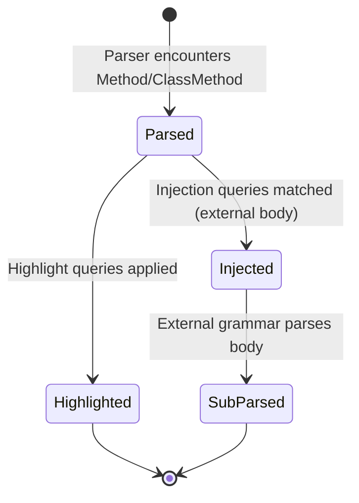

# Data Structure: method_definition

## Overview

The `method_definition` rule defines the AST structure for ObjectScript method declarations within UDL class files. It captures method name, arguments, return type, and body with support for four distinct body variants.

## Definition

**Location:** `udl/grammar.js:275-290`

```javascript
method_definition: ($) =>
  seq(
    field('name', alias($.quote_permitting_identifier, $.identifier)),
    field('arguments', $.arguments),
    optional(field('return_type', $.return_type)),
    choice($._core_method, $._expression_method, $._external_method, $._call_method),
  ),
```

## AST Node Structure

```
method_definition
├── name: identifier
├── arguments: arguments
│   └── argument* (with optional types and defaults)
├── return_type?: return_type
│   ├── keyword_as
│   └── typename
└── body: (one of)
    ├── _core_method
    │   ├── keywords?: method_keywords
    │   └── body: core_method_body_content
    ├── _expression_method
    │   ├── keywords: expression_method_keywords
    │   └── body: expression_method_body_content
    ├── _external_method
    │   ├── keywords: external_method_keywords
    │   └── body: external_method_body_content
    └── _call_method
        ├── keywords: call_method_keywords
        └── routine_tag_call
```

## Fields

| Field | Type | Required | Description |
|-------|------|----------|-------------|
| `name` | `identifier` | Yes | Method name (may be quoted) |
| `arguments` | `arguments` | Yes | Parameter list in parentheses |
| `return_type` | `return_type` | No | Return type with `As` keyword |
| `keywords` | `*_method_keywords` | Varies | Method modifiers in brackets |
| `body` | `*_body_content` | Yes | Method implementation |

## Body Variants

### 1. Core Method (`_core_method`)

Standard ObjectScript method with statements.

**Location:** `udl/grammar.js:295-302`

```javascript
_core_method: ($) =>
  seq(
    optional(field('keywords', $.method_keywords)),
    '{',
    field('body', alias(repeat($.statement), $.core_method_body_content)),
    '}',
  ),
```

**Example:**
```objectscript
Method Calculate(x As %Integer) As %Integer
{
    Set result = x * 2
    Return result
}
```

### 2. Expression Method (`_expression_method`)

Single expression return with `[ CodeMode = expression ]`.

**Location:** `udl/grammar.js:304-316`

```javascript
_expression_method: ($) =>
  seq(
    field('keywords', $.expression_method_keywords),
    '{', 
    field('body', alias($.expression, $.expression_method_body_content)),
    '}',
  ),
```

**Example:**
```objectscript
Method Double(x As %Integer) As %Integer [ CodeMode = expression ]
{
    x * 2
}
```

### 3. External Method (`_external_method`)

External language body with `[ Language = python|javascript|tsql ]`.

**Location:** `udl/grammar.js:318-326`

```javascript
_external_method: ($) =>
  seq(
    field('keywords', $.external_method_keywords),
    '{',
    field('body', $.external_method_body_content),
    '}',
  ),
```

**Example:**
```objectscript
Method PyCalculate(x As %Integer) As %Integer [ Language = python ]
{
    return x * 2
}
```

### 4. Call Method (`_call_method`)

Routine delegation with `[ CodeMode = call ]`.

**Location:** `udl/grammar.js:286-293`

```javascript
_call_method: ($) =>
  seq(
    field('keywords', $.call_method_keywords),
    '{', 
    $.routine_tag_call,
    '}',
  ),
```

**Example:**
```objectscript
Method Legacy() [ CodeMode = call ]
{
    LegacyTag^LegacyRoutine
}
```

## Method Keywords

Keywords appear in brackets `[ ... ]` and control method behavior:

| Keyword | Values | Effect |
|---------|--------|--------|
| `Abstract` | flag | No implementation required |
| `Final` | flag | Cannot be overridden |
| `Private` | flag | Class-internal only |
| `CodeMode` | `expression`, `call`, `objectgenerator`, `generator` | Body interpretation |
| `Language` | `objectscript`, `python`, `javascript`, `tsql` | Body language |
| `SqlProc` | flag | Expose as SQL procedure |
| `WebMethod` | flag | Expose as web method |
| `ZenMethod` | flag | Expose as Zen method |

**Location:** `udl/keywords.js`

## Ownership

- **Parent:** `method` or `classmethod` rule
- **Created by:** UDL parser during class parsing
- **Consumed by:** Language servers, syntax highlighters, injection queries

## Lifecycle



## Invariants

1. `arguments` is always present (may be empty `()`)
2. Exactly one body variant is matched
3. `external_method_body_content` is opaque text (not parsed as ObjectScript)
4. Keywords determine which body variant is valid

## Update Paths

Method definitions are read-only AST nodes. Updates occur via:

1. **Source edit** → Full or incremental re-parse
2. **Injection** → Body re-parsed with external grammar

## Query Patterns

### Highlight Query (method name)
```scheme
(method_definition
  name: (identifier) @function.method)
```

### Injection Query (Python body)
```scheme
(method_definition
  keywords: (external_method_keywords
    (method_keyword_language (rhs) @lang))
  body: (external_method_body_content) @injection.content
  (#match? @lang "(?i)^python$")
  (#set! injection.language "python"))
```

**Location:** `udl/queries/injections.scm:8-15`

## Related Structures

- `method` / `classmethod` — Parent rules that include keyword
- `arguments` — Parameter list structure
- `return_type` — Type annotation structure
- `method_keywords` / `external_method_keywords` — Keyword collections

## Assumptions

1. Method body always enclosed in `{ }`
2. Keywords always enclosed in `[ ]`
3. Quote-permitting identifiers handle `"special%names"`

## Open Questions

1. Should `generator` and `objectgenerator` code modes have dedicated body types?
2. How should malformed keyword combinations be handled?

## Evidence

- `udl/grammar.js:275-340` — Method definition and body variants
- `udl/keywords.js` — Method keyword definitions
- `udl/queries/injections.scm:8-50` — Injection patterns for external methods
- `udl/test/corpus/class-method.txt` — Test cases
