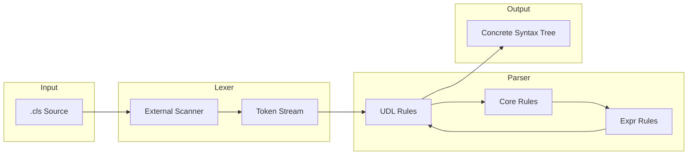

# Design Document: tree-sitter-objectscript

## Problem Statement

InterSystems ObjectScript is a mission-critical programming language used in healthcare, financial services, and data-intensive applications. Developers working with ObjectScript need modern editor features like syntax highlighting, code folding, and structural navigation, but existing tooling is limited to:

1. **InterSystems Studio** — Legacy IDE, Windows-only
2. **VS Code ObjectScript Extension** — Good but uses regex-based highlighting with limitations

Modern editors (Zed, Neovim, Emacs) support tree-sitter for parsing, which enables:
- Accurate, context-aware syntax highlighting
- Incremental parsing for real-time responsiveness
- Structural editing and code analysis
- Language injection for embedded code

**The problem:** There was no tree-sitter grammar for ObjectScript, leaving modern editor users without proper language support.

---

## Goals

| ID | Goal | Success Criteria |
|----|------|------------------|
| **G1** | Parse ObjectScript `.cls` files accurately | All valid ObjectScript syntax produces correct CST |
| **G2** | Support major ObjectScript constructs | Classes, methods, properties, commands, expressions |
| **G3** | Enable syntax highlighting | Provide highlight queries for all tokens |
| **G4** | Support language injection | Embedded SQL, HTML, Python, JavaScript, XML work correctly |
| **G5** | Integrate with popular editors | Zed, Neovim, Emacs have working integrations |
| **G6** | Provide multi-language bindings | Rust, Node.js, Python, Go, Swift, C bindings available |

---

## Non-Goals

| ID | Non-Goal | Rationale |
|----|----------|-----------|
| **NG1** | Full language server protocol | Out of scope; grammar provides parsing only |
| **NG2** | Semantic analysis | Type checking, symbol resolution are not grammar concerns |
| **NG3** | Code formatting | Better suited for dedicated tools |
| **NG4** | CSP file support (initial) | Requires inverted injection model; deferred to future work |
| **NG5** | Legacy Caché-only syntax | Focus on InterSystems IRIS dialect |

---

## Proposal

### Architecture Overview

Implement a **three-grammar hierarchy** that enables reuse and injection at multiple granularities:

```
┌─────────────────────────────────────────────────────────┐
│                     udl Grammar                         │
│  (Class definitions, methods, properties, XData, etc.)  │
│                                                         │
│    ┌─────────────────────────────────────────────────┐  │
│    │               core Grammar                      │  │
│    │  (Commands, control flow, embedded languages)   │  │
│    │                                                 │  │
│    │    ┌─────────────────────────────────────────┐  │  │
│    │    │           expr Grammar                  │  │  │
│    │    │  (Literals, operators, functions, orefs)│  │  │
│    │    └─────────────────────────────────────────┘  │  │
│    └─────────────────────────────────────────────────┘  │
└─────────────────────────────────────────────────────────┘
```

### Key Design Decisions

#### 1. Grammar Hierarchy

**Decision:** Three separate grammars with extension chain.

**Rationale:**
- ObjectScript expressions can be embedded in other contexts (e.g., SQL extensions with `$PIECE()` calls)
- ObjectScript statements can be used in routine files without class structure
- Clear separation enables future grammar extensions (e.g., CSP = HTML + ObjectScript injection)

**Implementation:**
```javascript
// udl/grammar.js
const objectscript_core = require('../core/grammar');
module.exports = grammar(objectscript_core, { name: 'objectscript', ... });

// core/grammar.js
const objectscript_expr = require('../expr/grammar');
module.exports = grammar(objectscript_expr, { name: 'objectscript_core', ... });
```

**Evidence:** `udl/grammar.js:15-18`, `core/grammar.js:5-8`

#### 2. External Scanner for Whitespace

**Decision:** Use C external scanner for whitespace-sensitive tokens.

**Rationale:**
ObjectScript has whitespace-sensitive syntax that cannot be expressed in context-free grammar:

| Syntax | Meaning |
|--------|---------|
| `SET x=1` | SET command with argument |
| `SET  cmd` | Argumentless SET followed by another command |
| `IF cond { }` | Block-style IF |
| `IF cond SET x=1` | Old-style IF with inline commands |

**Implementation:**
The scanner tracks state and detects:
- `_IMMEDIATE_SINGLE_WHITESPACE_FOLLOWED_BY_NON_WHITESPACE` — 1 space = argument follows
- `_ARGUMENTLESS_COMMAND_END` — 2 spaces = argumentless
- `_ARGUMENTLESS_LOOP` — whitespace before `{` = block style
- `_TERMINATION` — newline or statement separator

**Evidence:** `common/scanner.h:1-40` (token enum), `common/scanner.h:100-500` (scan logic)

#### 3. Method Body Variants

**Decision:** Four distinct method body types with different parsing strategies.

**Rationale:**
ObjectScript methods can have different body formats based on keywords:

| Keyword | Body Type | Parsing |
|---------|-----------|---------|
| (default) | `_core_method` | Parse as ObjectScript statements |
| `CodeMode = expression` | `_expression_method` | Parse as single expression |
| `Language = python` | `_external_method` | Raw text for injection |
| `CodeMode = call` | `_call_method` | Routine tag call |

**Implementation:**
```javascript
method_definition: ($) => seq(
  field('name', $.identifier),
  field('arguments', $.arguments),
  optional(field('return_type', $.return_type)),
  choice($._core_method, $._expression_method, $._external_method, $._call_method),
),
```

**Evidence:** `udl/grammar.js:275-340`

#### 4. Language Injection via Queries

**Decision:** Use tree-sitter injection queries instead of inline grammar rules.

**Rationale:**
- Embedded languages (SQL, HTML, Python, JavaScript) have mature tree-sitter grammars
- Injection queries are editor-configurable and extensible
- Avoids grammar complexity and maintenance burden

**Implementation:**
```scheme
; udl/queries/injections.scm
(method_definition
  keywords: (external_method_keywords
    (method_keyword_language (rhs) @lang))
  body: (external_method_body_content) @injection.content
  (#match? @lang "(?i)^python$")
  (#set! injection.language "python"))
```

**Evidence:** `udl/queries/injections.scm:1-150`, `core/queries/injections.scm`

#### 5. Keyword Modularization

**Decision:** Separate keyword definitions into dedicated module.

**Rationale:**
- ObjectScript has many keywords with various combinations
- Keywords are case-insensitive and have abbreviations
- Modular structure improves maintainability

**Implementation:**
```javascript
// udl/keywords.js
module.exports = {
  method_keywords: ($) => seq('[', repeat_with_commas(choice(
    $.kw_abstract, $.kw_final, $.kw_private, ...
  )), ']'),
  // ...
};
```

**Evidence:** `udl/keywords.js`, `udl/grammar.js:19` (require)

### Data Flow



### Grammar Rule Examples

#### Class Definition

```javascript
class_definition: ($) => seq(
  field('keyword', $.keyword_class),
  field('class_name', $.identifier),
  optional($.class_extends),
  optional($.class_keywords),
  field('class_body', $.class_body),
),
```

**Parses:**
```objectscript
Class MyPackage.MyClass Extends %Persistent [ Abstract, Final ]
{
  // class members
}
```

#### Command with Post-Conditional

```javascript
command_set: ($) => build_command_rule_argumentful(
  $,
  $.keyword_set,
  repeat_with_commas($.set_argument),
),
// where build_command_rule_argumentful adds:
// - optional post_conditional
// - whitespace handling
```

**Parses:**
```objectscript
SET:condition x = 1, y = 2
```

#### Embedded SQL

```javascript
embedded_sql_amp: ($) => seq(
  field('command_name', $.keyword_embedded_sql_amp),
  token.immediate('('),
  $.paren_fenced_text,
  token.immediate(')'),
),
```

**Parses:**
```objectscript
&sql(SELECT * FROM MyTable WHERE ID = :id)
```

---

## Alternatives Considered

### Alternative 1: Single Monolithic Grammar

**Approach:** One grammar file with all rules.

**Pros:**
- Simpler build process
- No grammar extension complexity

**Cons:**
- Cannot inject expressions separately
- Harder to maintain large grammar
- Cannot reuse for routine files

**Decision:** Rejected in favor of hierarchy.

### Alternative 2: Regex-Based Whitespace Handling

**Approach:** Use complex regex patterns in grammar rules.

**Pros:**
- No external scanner needed
- Easier debugging

**Cons:**
- Cannot handle true context sensitivity
- Would produce incorrect parses for edge cases
- Pattern complexity would be unmaintainable

**Decision:** Rejected; external scanner is necessary.

### Alternative 3: Inline Language Grammars

**Approach:** Embed SQL, HTML, etc. rules directly in grammar.

**Pros:**
- Single grammar file
- No external dependencies

**Cons:**
- Massive grammar size
- Maintenance burden for embedded languages
- Would diverge from upstream language grammars

**Decision:** Rejected in favor of injection queries.

---

## Tradeoffs

| Decision | Benefit | Cost |
|----------|---------|------|
| Three-grammar hierarchy | Reusability, injection flexibility | Regeneration cascade on changes |
| External scanner | Correct whitespace handling | C code complexity, debugging difficulty |
| Injection queries | Leverages mature grammars | Requires users to install extra grammars |
| Case-insensitive regex | Correct keyword matching | Larger state machine, slower lexing |
| Method body variants | Correct body parsing | Grammar complexity, conflicts |

---

## Validation

### Test Strategy

1. **Corpus Tests:** `test/corpus/*.txt` files with expected parse trees
2. **Binding Tests:** Verify parser creation in each language
3. **Integration Tests:** Editor-specific testing (Zed, Neovim, Emacs)

### Test Commands

```bash
# Grammar tests
cd udl && tree-sitter test

# Binding tests
cargo test                                    # Rust
npm test                                      # Node.js
python -m pytest bindings/python/tests/      # Python
go test ./bindings/go/...                    # Go
swift test                                    # Swift
make test                                     # C
```

### Coverage Metrics

| Component | Test Files | Coverage |
|-----------|------------|----------|
| expr | `expr/test/corpus/` | Core expressions, operators |
| core | `core/test/corpus/` | Commands, control flow, embedded |
| udl | `udl/test/corpus/` | Classes, methods, properties |

**Evidence:** `README.md:200-280` — Testing bindings instructions

---

## Implementation Plan

### Phase 1: Core Grammar (Completed)
- [x] Expression grammar (literals, operators, functions)
- [x] Core grammar (commands, control flow)
- [x] External scanner

### Phase 2: UDL Grammar (Completed)
- [x] Class definitions
- [x] Method body variants
- [x] Properties, parameters, indexes
- [x] XData, storage, triggers

### Phase 3: Editor Integration (Completed)
- [x] Zed extension
- [x] nvim-treesitter registration
- [x] Emacs major mode

### Phase 4: Language Bindings (Completed)
- [x] Rust crate
- [x] npm package
- [x] Python package
- [x] Go module
- [x] Swift package
- [x] C library

### Phase 5: Future Work (Planned)
- [ ] CSP file support (HTML base + ObjectScript injection)
- [ ] Remaining preprocessor directives
- [ ] Performance optimization

---

## Assumptions

1. **Tree-sitter compatibility:** Grammar targets tree-sitter 0.20+ API
2. **ObjectScript dialect:** Targets InterSystems IRIS 2023.1+ syntax
3. **Editor support:** Target editors implement tree-sitter query predicates
4. **Injection availability:** Users will install required injection grammars

## Open Questions

1. How should we handle syntax that is valid in Caché but not IRIS?
2. Should we provide a "strict" mode that rejects deprecated syntax?
3. What is the best approach for CSP file support?

## Evidence

- `README.md:1-300` — Project documentation
- `tree-sitter.json:1-80` — Grammar configuration
- `udl/grammar.js:1-600` — UDL grammar implementation
- `core/grammar.js:1-1200` — Core grammar implementation
- `expr/grammar.js` — Expression grammar implementation
- `common/scanner.h:1-700` — External scanner implementation
- `udl/queries/injections.scm:1-150` — Injection patterns
- `udl/test/corpus/` — Test corpus files
